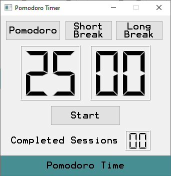

# Qt-Pomodoro-Timer
A Simple Pomodoro Timer Built with Qt Framework.

## Ui Preview

### TODO
- Finish coding.
- Clean code.

### Additional Credits
 -[Sound effects by Eric Matyas – soundimage.org](https://soundimage.org/sfx-alerts/)